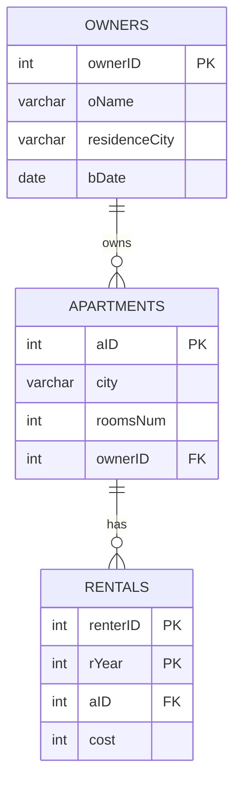

# Rental Management Database & Django App

A database-focused web application for exploring apartment rental data, running advanced SQL queries, adding rental agreements, and viewing owner analytics. I developed the project independently for a Database Management course and later organized it as a portfolio repository.

## Highlights

- Designed a relational schema connecting property owners, apartments, and annual rental agreements.
- Implemented eight reusable SQL Server views using joins, grouping, correlated subqueries, `NOT EXISTS`, and aggregation.
- Connected Django to Microsoft SQL Server/Azure SQL through the `mssql-django` backend.
- Built pages for analytical queries, owner search and statistics, and validated rental insertion.
- Used parameterized SQL in the Django backend to avoid constructing queries from user input.
- Included a reproducible database loader and a synthetic sample dataset with 40 owners, 85 apartments, and 735 rental records.

## Technology

- Python and Django
- Microsoft SQL Server / Azure SQL
- SQL, HTML, and CSS
- Django database connection API

## Data Model



## Application Features

### Query dashboard

The application presents three multi-stage analytical queries built on reusable SQL views:

1. Identifies the highest-paying renter or renters for qualifying apartments.
2. Finds cities connecting renters and owners who meet defined minimalist-rental criteria.
3. Summarizes apartments rented by selected owners to renters with a defined co-rental pattern.

### Rental entry

Users can add a rental for the current year. The backend validates numeric input, checks apartment and renter existence, prevents duplicate annual agreements, and warns when an apartment exceeds five renters in the same year.

### Owner analytics

Users can search owners by name or retrieve statistics by owner ID, including the number of apartments, average renters per apartment-year, and other owners in the same residence city.

## Repository Structure

```text
.
|-- Rentals_App/                 # Django application and database logic
|-- rental_management/           # Django project configuration
|-- data/                        # Synthetic sample CSV data
|-- sql/
|   |-- schema.sql               # Relational schema
|   `-- views.sql                # Reusable analytical views
|-- static/                      # Images and styling
|-- templates/                   # Django templates
|-- .env.example                 # Required environment variables
|-- manage.py
`-- requirements.txt
```

## Local Setup

### Prerequisites

- Python 3.10 or newer
- Microsoft SQL Server or Azure SQL
- Microsoft ODBC Driver 18 for SQL Server

### Installation

1. Clone the repository and enter its directory.
2. Create and activate a virtual environment.
3. Install the Python dependencies:

   ```bash
   pip install -r requirements.txt
   ```

4. Copy `.env.example` to `.env` and replace the placeholders with your own database values. Never commit the `.env` file.
5. Create an empty SQL Server database, then initialize it with the included schema, sample data, and views:

   ```bash
   python manage.py load_sample_data
   ```

   To rebuild a development database that already contains these objects:

   ```bash
   python manage.py load_sample_data --reset
   ```

6. Start the development server:

   ```bash
   python manage.py runserver
   ```

7. Open `http://127.0.0.1:8000/`.

## Tests

The unit tests cover input validation and URL routing without requiring a live SQL Server instance:

```bash
python manage.py test --settings=rental_management.test_settings
```

The same command runs automatically through GitHub Actions on pushes and pull requests.

## Security Notes

- Database credentials and the Django secret key are read from environment variables.
- The repository contains only synthetic course data.
- The included configuration is intended for local development and demonstration, not production deployment.

## Portfolio Maintenance

The portfolio version adds secret-safe configuration, reproducible setup, validation, tests, documentation, and presentation cleanup while preserving the database concepts and application features developed for the course project.
